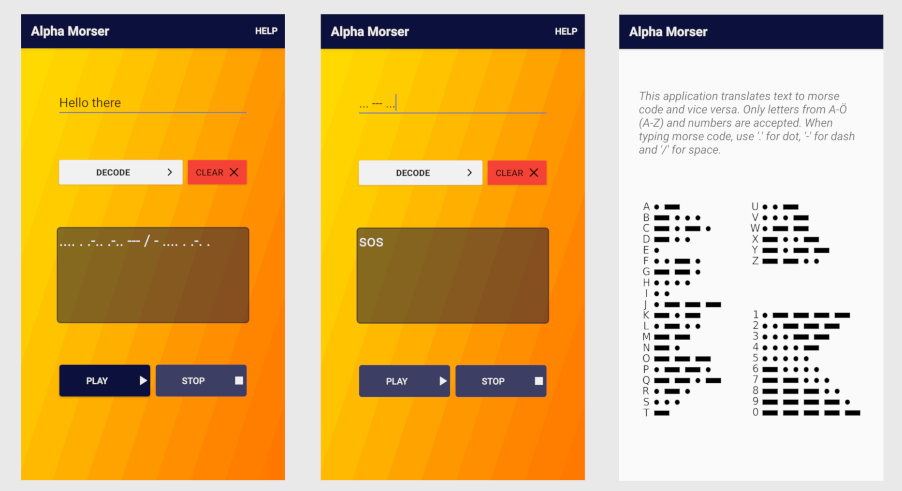

# Alpha-Morser
Alpha Morser - Morse Translator for Android

This application translates text to morse code and vice versa. Alpha Morser also repeats morse code as sound.

Current method of sequencing and repeating morse code uses Kotlins Coroutine Delay function -> Repeated message is not perfectly synchronized.
